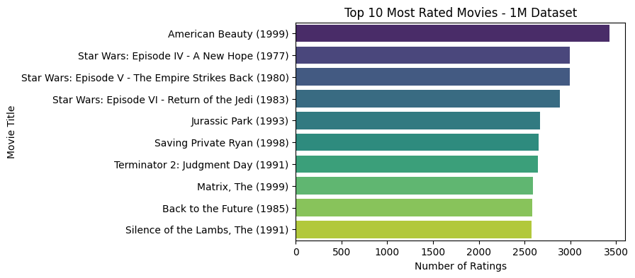
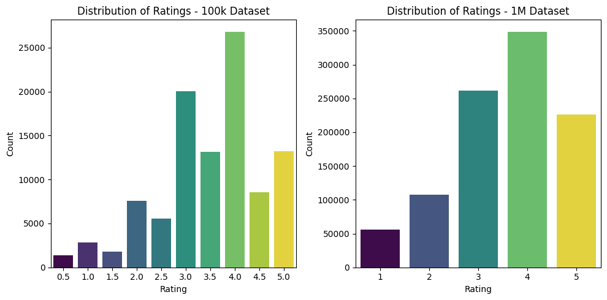
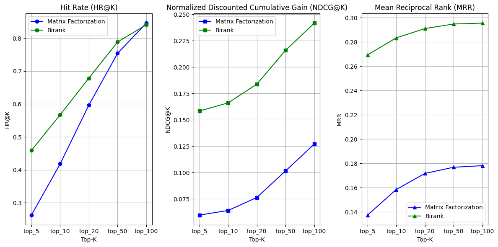

# BiRank vs Matrix Factorization for Recommendation Systems

A comparative analysis of two popular recommendation algorithms: BiRank (a bipartite graph ranking algorithm) and Matrix Factorization, implemented in Python using the MovieLens dataset.

## 📋 Overview

This project compares the performance of BiRank and Matrix Factorization algorithms for building recommendation systems. It includes implementations, visualizations, and performance metrics to help understand the strengths and trade-offs of each approach.

## 🚀 Quick Start

### Running in Google Colab (Recommended)

1. Open the notebook in Google Colab:
   - Click on `birank_and_matrix_factorization.ipynb`
   - Click the "Open in Colab" button
2. Execute the first 6-7 cells to:
   - Mount Google Drive for data persistence
   - Install required dependencies
   - Download the MovieLens datasets (100k and 1M)
   - Import utility plotting functions
3. Follow along with the analysis!

### Running Locally

```bash
# Clone the repository
git clone https://github.com/abiget/birank-and-matrix-factorization-recommendation.git
cd birank-and-matrix-factorization-recommendation

# Install dependencies (create a virtual environment first, recommended)
pip install jupyter numpy pandas scipy matplotlib seaborn scikit-learn ipywidgets

# Launch Jupyter Notebook
jupyter notebook birank_and_matrix_factorization.ipynb
```

## ��� Datasets

The project uses two MovieLens datasets:
- **MovieLens 100K**: ~100,000 ratings from 600 users on 9,000 movies
- **MovieLens 1M**: ~1,000,000 ratings from 6,040 users on 3,900 movies

Datasets are automatically downloaded from [GroupLens](https://grouplens.org/datasets/movielens/) when you run the notebook.

**Note:** The visualizations and results shown below are based on the **MovieLens 1M dataset**.

## 🔍 Algorithms Compared

### BiRank
A graph-based algorithm that leverages the bipartite structure of user-item interactions to generate recommendations through iterative ranking. This approach treats the recommendation problem as a graph ranking task.

### Matrix Factorization
A collaborative filtering approach that decomposes the user-item interaction matrix into lower-dimensional latent factor matrices, capturing underlying patterns in user preferences and item characteristics.

## 📈 Results & Visualizations

### Exploratory Data Analysis (1M Dataset)

#### Top 15 Most Rated Movies


The most popular movies in the MovieLens 1M dataset show strong preferences for:
- **Classic films** from the 1990s dominate the top positions
- **"Forrest Gump" (1994)** leads with ~3,500 ratings
- **"Shawshank Redemption" (1994)** and **"Pulp Fiction" (1994)** follow closely with ~3,000 ratings each
- **Star Wars franchise** films appear multiple times, showing enduring popularity
- Strong representation of critically acclaimed dramas and action films

This reveals user engagement patterns focused on well-known, highly-rated mainstream cinema.

#### Rating Distribution


Analysis of the 1M dataset rating patterns:
- **Heavily skewed toward positive ratings**: 4.0 stars is the most common rating (~350,000 occurrences)
- **5-star ratings**: Second most common (~225,000 ratings)
- **3-star ratings**: Third most common (~260,000 ratings)
- **Low ratings are rare**: Very few 1-star (~55,000) and 0.5-star ratings
- **Rating scale**: Uses 1-5 stars (compared to 0.5-5.0 in the 100K dataset)

Key insight: Users predominantly rate movies they enjoy, creating a **positive rating bias** in the dataset. This affects recommendation algorithms as they need to distinguish between "good" and "great" rather than "bad" and "good."

### Algorithm Performance Comparison (1M Dataset)



#### Hit Rate (HR@K)
- **BiRank** (green) consistently outperforms Matrix Factorization (blue) across all K values
- **Top-5**: BiRank achieves ~46% vs Matrix Factorization's ~26%
- **Top-100**: BiRank reaches ~90% while Matrix Factorization achieves ~85%
- Both algorithms show strong improvement as K increases
- **Gap narrows at higher K values**, but BiRank maintains its lead

#### Normalized Discounted Cumulative Gain (NDCG@K)
- **BiRank demonstrates superior ranking quality** at all K values
- **Top-5**: BiRank ~0.16 vs Matrix Factorization ~0.06 (nearly 3x better)
- **Top-100**: BiRank achieves ~0.245 vs Matrix Factorization's ~0.125 (nearly 2x better)
- This is BiRank's **strongest advantage** - it places relevant items much higher in recommendation lists
- Steady improvement with increasing K for both algorithms

#### Mean Reciprocal Rank (MRR)
- **BiRank maintains significantly higher MRR** across all K values
- **BiRank**: Ranges from ~0.27 to ~0.30 (peaks at top-50)
- **Matrix Factorization**: Ranges from ~0.14 to ~0.18
- BiRank places the **first relevant item approximately twice as high** in the ranking
- Performance plateaus after top-50 for both algorithms, suggesting diminishing returns

### Key Insights from 1M Dataset

🎯 **BiRank dominates across all metrics** (HR@K, NDCG@K, MRR) with the most significant advantage in ranking quality

🎯 **Graph-based approach excels** - BiRank better captures the complex user-item relationships in large-scale data

🎯 **Scalability confirmed** - With 1M ratings, BiRank's performance advantage is consistent and reliable

🎯 **Ranking precision matters** - BiRank's nearly 3x better NDCG@5 shows superior top-N recommendation quality

🎯 **Positive bias impact** - Both algorithms must distinguish subtle preferences in a positively-skewed rating distribution


## 🎯 Conclusion

This analysis on the **MovieLens 1M dataset** demonstrates that:
- **BiRank is the superior algorithm** across all evaluated metrics with substantial margins
- Graph-based ranking approaches significantly outperform traditional matrix factorization, especially for **top-N recommendations**
- Both algorithms scale well with increasing K values
- The **positive rating bias** in real-world datasets (like MovieLens 1M) presents challenges that BiRank handles more effectively

### When to Use Each Algorithm

**Use BiRank when:**
- Ranking quality (NDCG) is critical for your application
- You need the **best items at the very top** of recommendations (top-5, top-10)
- Graph structure of user-item interactions can be leveraged
- You have sufficient data to build a meaningful bipartite graph

**Use Matrix Factorization when:**
- Computational efficiency is a priority
- You need to capture and interpret **latent features** explicitly
- **Cold-start** scenarios require feature-based predictions
- Model interpretability is important for your use case
- You need acceptable performance with less computational overhead


## 📝 License

This project is open source and available under the [MIT License](LICENSE).

---

⭐ If you found this project helpful, please consider giving it a star!
